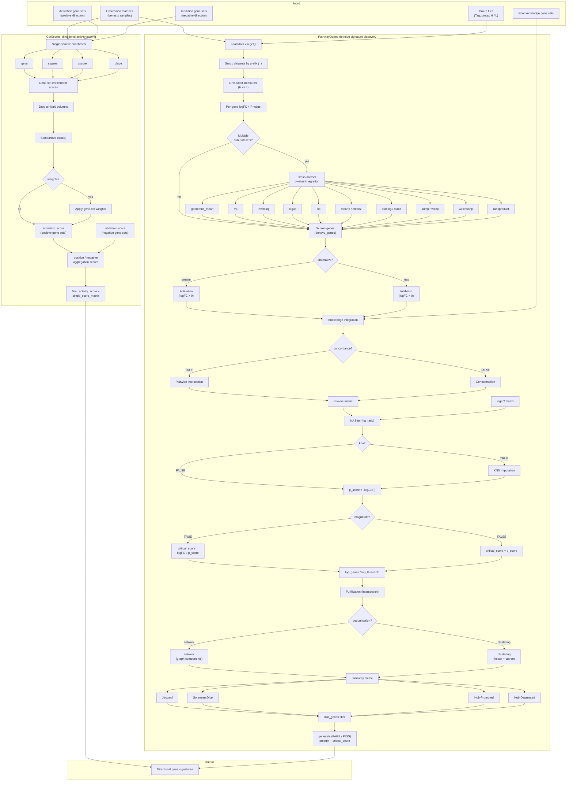

# PathwayQuant

A unified, direction-resolved framework for pathway activity quantification and
de novo gene-signature discovery from multi-cohort expression data.

## Highlights

- **Direction-aware pathway quantification.** Pathway activation and inhibition
  are modeled separately and fused into a single signed activity score,
  preserving the regulatory direction that undirected enrichment methods
  discard.
- **Cohort-agnostic single-sample scoring.** `GetScores` supports GSVA, ssGSEA,
  z-score, and PLAGE for sample-level, batch-robust pathway activity
  estimation.
- **Multi-cohort de novo discovery.** `PathwayQuant` couples one-sided
  differential analysis with thirteen cross-dataset p-value integration
  strategies—including robust rank aggregation and the Cauchy combination
  test—to synthesize evidence across heterogeneous cohorts.
- **Knowledge-guided refinement.** Prior gene sets are fused with de novo
  signatures through pairwise concordance filtering, bridging data-driven and
  hypothesis-driven discovery.
- **Redundancy-aware consolidation.** Jaccard, Sørensen-Dice, and hub-based
  similarity, combined with graph-component detection or hierarchical
  clustering, resolve biologically redundant gene sets.
- **Translation-ready signatures.** The resulting `PAGS` (activation) and
  `PIGS` (inhibition) panels are compact, interpretable, and directly usable
  for downstream scoring, validation, and biomarker translation.

## Pipeline overview



## Installation

Run the following in a fresh R session:

```r
install.packages("pak")
pak::pkg_install("FangZY-Lab/PathwayQuant")
```

`pak` installs all dependencies automatically. Alternatively, install them
explicitly:

```r
install.packages("BiocManager")
BiocManager::install(c("GSVA", "limma", "RankProd", "impute"))
install.packages(c("metap", "reshape2", "igraph", "RobustRankAggreg", "tidyverse"))

install.packages("remotes")
remotes::install_github("FangZY-Lab/PathwayQuant", upgrade = FALSE)
```

Then load the package:

```r
library(PathwayQuant)
```

## Quick start

The example below simulates ten expression datasets grouped into five studies
(`SimDataA`, `SimDataB`, `SimDataC`, `SimDataD`, `SimDataE`), where A, C, and D
each comprise several sub-datasets. `GetScores` computes sample-level
directional activity scores, and `PathwayQuant` discovers activation and
inhibition gene signatures.

```r
library(PathwayQuant)
set.seed(123)

make_dataset <- function(n_genes = 100, n_h = 30, n_l = 30, seed = 1) {
  set.seed(seed)
  n_samples <- n_h + n_l
  samples <- c(paste0("S", seq_len(n_h)), paste0("S", n_h + seq_len(n_l)))

  mat <- matrix(rnorm(n_samples * n_genes), nrow = n_genes, ncol = n_samples)
  # 10 activation genes: higher expression in the high-pathway (H) group.
  mat[1:10, seq_len(n_h)] <- mat[1:10, seq_len(n_h)] + 2
  # 10 inhibition genes: higher expression in the low-pathway (L) group.
  mat[11:20, n_h + seq_len(n_l)] <- mat[11:20, n_h + seq_len(n_l)] + 2

  expr <- as.data.frame(mat)
  rownames(expr) <- paste0("GENE", seq_len(n_genes))
  colnames(expr) <- samples

  group <- data.frame(
    Tag = samples,
    group = c(rep("H", n_h), rep("L", n_l)),
    stringsAsFactors = FALSE
  )
  list(expr = expr, group = group)
}

# Ten datasets across five studies. A, C, and D are split into sub-datasets.
dataset_seed <- c(
  SimDataA_a = 101, SimDataA_b = 102, SimDataA_c = 103,
  SimDataB   = 104,
  SimDataC_a = 105, SimDataC_b = 106, SimDataC_c = 107,
  SimDataD_a = 108, SimDataD_b = 109,
  SimDataE   = 110
)

for (nm in names(dataset_seed)) {
  d <- make_dataset(seed = dataset_seed[[nm]])
  assign(nm, d$expr)
  assign(paste0(nm, "_G"), d$group)
}

datasets <- names(dataset_seed)

# Twenty knowledge gene sets, each containing ten genes (drawn from GENE1-GENE100).
knowledge_genesets <- setNames(
  lapply(1:20, function(i) paste0("GENE", ((0:9) + (i - 1) * 5) %% 100 + 1)),
  paste0("pathway_", sprintf("%02d", 1:20))
)

# 1. Sample-level directional pathway activity scores.
scores <- GetScores(
  expression_profile = SimDataA_a,
  activation_geneset = list(
    pos_activation_A = paste0("GENE", 1:5),
    pos_activation_B = paste0("GENE", 6:10)
  ),
  inhibition_geneset = list(
    neg_inhibition_A = paste0("GENE", 11:15),
    neg_inhibition_B = paste0("GENE", 16:20)
  ),
  method = "ssgsea"
)
head(scores$final_activity_score)

# 2. Discover activation signatures (up-regulated genes).
activation <- PathwayQuant(
  expression_accession_vector = datasets,
  alternative = "greater",
  denovo_genes = 50,
  top_genes = 20,
  knowledge_genesets = knowledge_genesets,
  concordance = TRUE,
  knn = FALSE,
  p_combine_method = "geometric_mean",
  magnitude = FALSE,
  similarity_metric = "Jaccard",
  deduplication = "network",
  linkage = "ward.D",
  similarity_threshold = 0.5,
  min_genes = 5
)
str(activation$genesets)

# 3. Discover inhibition signatures (down-regulated genes).
inhibition <- PathwayQuant(
  expression_accession_vector = datasets,
  alternative = "less",
  denovo_genes = 50,
  top_genes = 20,
  knowledge_genesets = knowledge_genesets,
  concordance = TRUE,
  knn = FALSE,
  p_combine_method = "geometric_mean",
  magnitude = FALSE,
  similarity_metric = "Jaccard",
  deduplication = "network",
  linkage = "ward.D",
  similarity_threshold = 0.5,
  min_genes = 5
)
str(inhibition$genesets)
```

If the demo works, the activation signatures contain the planted activation
genes (`GENE1`-`GENE10`) and the inhibition signatures contain the planted
inhibition genes (`GENE11`-`GENE20`).

## Function reference

### `GetScores()`

Sample-level directional pathway activity scoring via single-sample enrichment.

```r
GetScores(
  expression_profile,
  activation_geneset,
  inhibition_geneset,
  method = "ssgsea",
  min.sz = 1,
  max.sz = 10000,
  equity = FALSE,
  weights = NULL
)
```

| Argument | Description | Default |
| --- | --- | --- |
| `expression_profile` | Matrix/data frame of expression values, genes as rows and samples as columns. | required |
| `activation_geneset` | Named list of activation (positive-direction) gene sets; names should contain `"pos"`. | required |
| `inhibition_geneset` | Named list of inhibition (negative-direction) gene sets; names should contain `"neg"`. | required |
| `method` | Enrichment method: `"gsva"`, `"ssgsea"`, `"zscore"`, or `"plage"`. | `"ssgsea"` |
| `min.sz` | Minimum gene-set size. | `1` |
| `max.sz` | Maximum gene-set size. | `10000` |
| `equity` | If `TRUE`, aggregate by the mean-score difference; otherwise sum-normalized. | `FALSE` |
| `weights` | Optional named numeric vector of gene-set weights. | `NULL` |

Returns `list(final_activity_score, single_score_matrix)`.

### `PathwayQuant()`

Multi-cohort de novo gene-signature discovery with knowledge-guided refinement
and redundancy resolution.

```r
PathwayQuant(
  expression_accession_vector,
  alternative = "greater",
  denovo_genes = 1000,
  top_genes = NULL,
  top_threshold = NULL,
  knowledge_genesets = NULL,
  concordance = TRUE,
  knn = FALSE,
  p_combine_method = "geometric_mean",
  na_ratio = 0.3,
  magnitude = FALSE,
  similarity_metric = "Jaccard",
  deduplication = "network",
  linkage = "ward.D",
  similarity_threshold = 0.5,
  min_genes = 5
)
```

| Argument | Description | Default |
| --- | --- | --- |
| `expression_accession_vector` | Dataset names; each must exist in the calling environment together with `<name>_G` (columns `Tag`, `group` with `"H"`/`"L"`). | required |
| `alternative` | Test direction: `"greater"` (activation) or `"less"` (inhibition). | `"greater"` |
| `denovo_genes` | Number of top de novo genes retained per dataset. | `1000` |
| `top_genes` | Number of top genes retained in the final signature. | `NULL` |
| `top_threshold` | Critical-score threshold for the final signature. | `NULL` |
| `knowledge_genesets` | Named list of prior gene sets. | `NULL` |
| `concordance` | If `TRUE`, intersect de novo and knowledge sets pairwise. | `TRUE` |
| `knn` | If `TRUE`, KNN-impute missing values. | `FALSE` |
| `p_combine_method` | Cross-dataset p-value integration: `"geometric_mean"`, `"rra"`, `"invchisq"`, `"logitp"`, `"cct"`, `"meanp"`, `"meanz"`, `"sumlog"`, `"sumz"`, `"sump"`, `"votep"`, `"wilkinsonp"`, `"rankproduct"`. | `"geometric_mean"` |
| `na_ratio` | Maximum missing-value proportion per gene. | `0.3` |
| `magnitude` | If `TRUE`, weight p-score by logFC magnitude. | `FALSE` |
| `similarity_metric` | `"Jaccard"`, `"Sorensen-Dice"`, `"Hub-Promoted"`, `"Hub-Depressed"`. | `"Jaccard"` |
| `deduplication` | `"network"` or `"clustering"`. | `"network"` |
| `linkage` | Hierarchical clustering linkage (when `deduplication = "clustering"`). | `"ward.D"` |
| `similarity_threshold` | Similarity threshold for merging gene sets. | `0.5` |
| `min_genes` | Minimum genes per final gene set. | `5` |

Returns `list(genesets, pmatrix, critical_score)` and, when
`magnitude = TRUE`, `fcmatrix`.

## Notes

1. `PathwayQuant()` reads expression and group data from the calling
   environment via `get()`. Create the objects in the same environment where
   you call the function.
2. Specify the method-selection arguments explicitly (for example `method`,
   `alternative`, `p_combine_method`, `similarity_metric`, `deduplication`,
   `linkage`), as shown in the examples.

## Author

Dingkang Zhao (赵定康)

Email: <dingkang.25@intl.zju.edu.cn>
